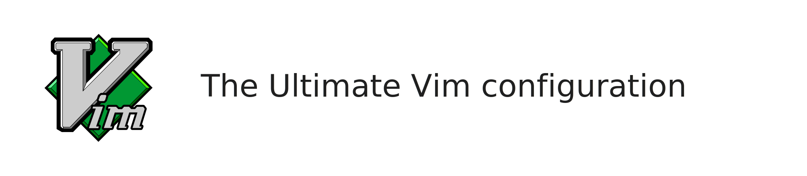
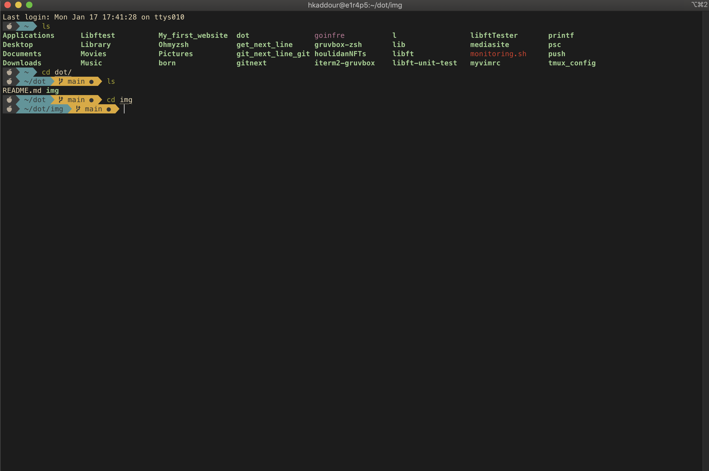
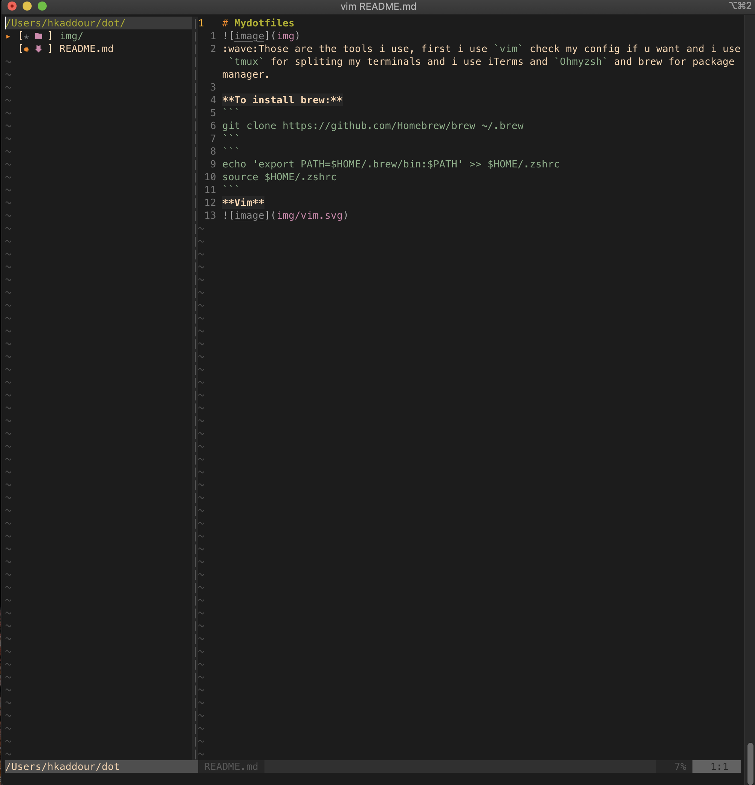
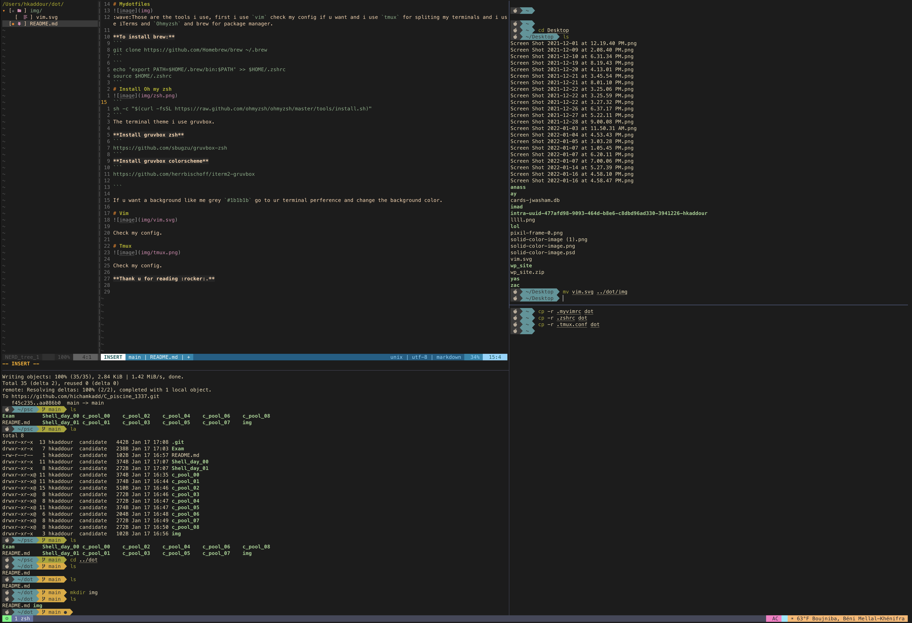
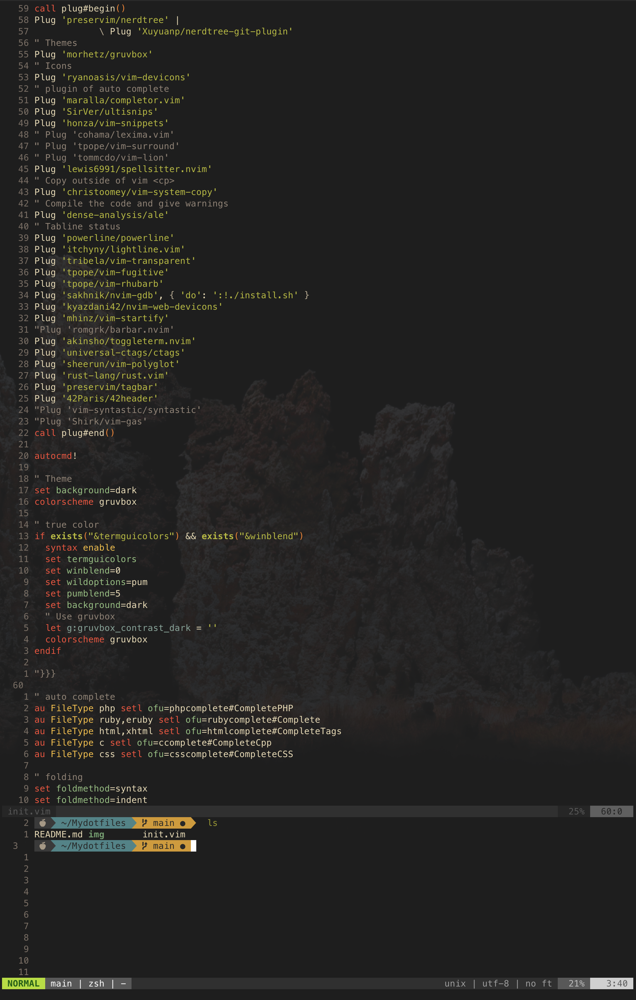

# Mydotfiles

:wave:Those are the tools i use, first i use `vim` check my config if u want and i use `tmux` for spliting my terminals and i use iTerms and `Ohmyzsh` and brew for package manager.

**To install brew:**
```
git clone https://github.com/Homebrew/brew ~/.brew
```
```
echo 'export PATH=$HOME/.brew/bin:$PATH' >> $HOME/.zshrc
source $HOME/.zshrc
```
# Install Oh my zsh

```
sh -c "$(curl -fsSL https://raw.github.com/ohmyzsh/ohmyzsh/master/tools/install.sh)"
```
The terminal theme i use is `gruvbox`.

**Install gruvbox zsh**
```
https://github.com/sbugzu/gruvbox-zsh
```
**Install gruvbox colorscheme**
```
https://github.com/herrbischoff/iterm2-gruvbox

```

If u want a background like me grey `#1b1b1b` go to ur terminal perference and change the background color.

# Vim


Check my config.

# Tmux


# Nvim

Check my config.

**Thank u for reading :rocket:.**
